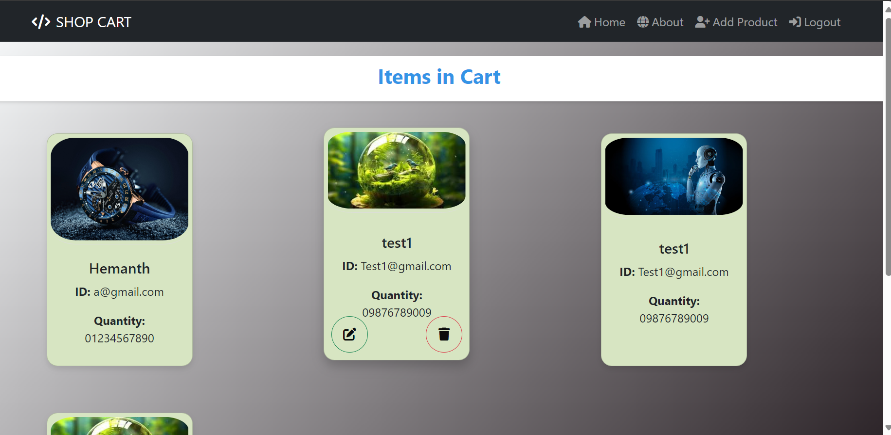

# Shop.this

## Table of contents

- [Introduction](#introduction)
- [Demo](#demo)
- [Run](#run)
- [Technology](#technology)
- [Features](#features)
- [Database Models](#database)
- [Color Palette](#colors)
- [License](#license)

## Introduction

A virtual ecommerce website using Node js, Express js, and Mongoose.

NOTE: Please read the RUN section before opening an issue.

## Demo

The website resembles a real store and you can add products to your cart and pay for them. If you want to try the checkout process.

## Run

To run this application, you have to set your own environmental variables. For security reasons, some variables have been hidden from view and used as environmental variables with the help of dotenv package. Below are the variables that you need to set in order to run the application:

- MONGO_URI: this is the connection string of your MongoDB Atlas database.

- SESSION_SECRET: a secret message for the session. You can use any string here.

Username, Password: the email and password used to log into the main home page. You can put any email and password here.

Now set up the required modules using syntax npm/yarn install <required modules> :Ex: npm install mongoose.

#Note:Create an upload folder to 

Now you can run "npm start"/node index.js/npm run dev in the terminal and the application should work.

## Technology

The application is built with:

- Node.js version 12.16.3
- MongoDB version 4.2.0
- Express version 4.16.1
- Bootstrap version 4.4.1
- FontAwesome version 5.13.0
- Mongoose 
- Express Session
- Dotenv
- Ejs
- Multer
- Express Generator ->
- Nodemon 
- Jwt- Json web token 
- cors
- bcryptjs
- Express Validator: used for form validation

## Features

The application displays a virtual product store that contains virtual products and product related information using crud operation using node,express,mongodb.

Users can do the following:

- Create an account, login or logout
- Add products to the shopping cart
- Delete products from the shopping cart
- Edit products from the shopping cart
- Display the shopping cart
- User Athentication 
- Product UI
- Backend Database with different APIs like creating,retrieving,update,delete
- Edit and delete prouduct using UI

Admins can do the following:

- Login or logout to the admin panel
- View all the information stored in the database. They can view/add/edit/delete orders, users, products and categories

## Database

All the models can be found in the models directory created using mongoose.

### User Schema:

- username (String)
- email (String)
- password (String)

### Product Schema:

- Name(String)
- Email(String)
- Phone No(String)
- Image-data(String)
- created - (Date)

## Colors

Below is the color palette used in this application:

-  `#478ba2`
-  `#b9d4db`
-  `#e9765b`
-  `#f2a490`
-  `#de5b6d`
-  `#18a558`
-  `#f9f7f4`
-  `#202020`
-  `#474747`

## License

Apache-2.0 License:
